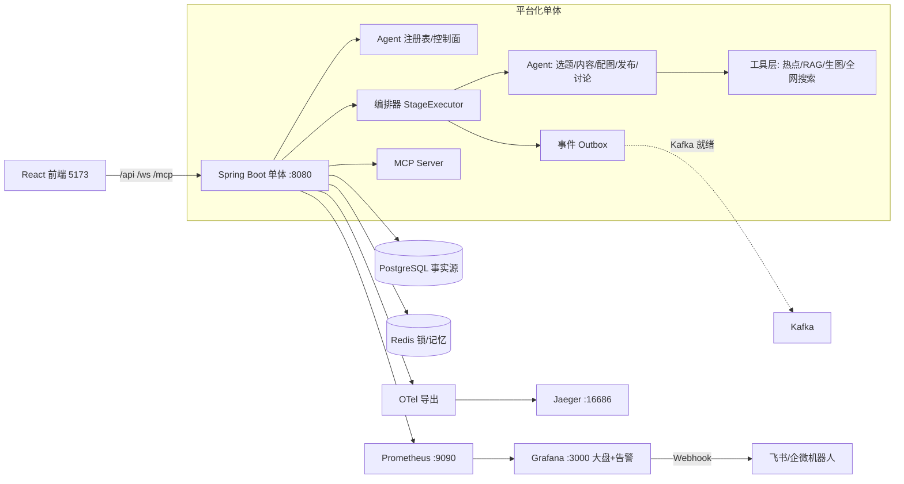

# Content Ops — 多 Agent 内容运营平台

> AI 驱动的多平台内容生产流水线：从热点追踪、选题策划到图文/全图作品产出的完整闭环，
> 按大厂多 Agent 架构标准建设（MCP / A2A / OTel / LLM-as-Judge / RBAC / 容器化）。

## 一、核心能力

| 模块 | 能力 |
|------|------|
| 热点监控 | 7 平台真实热榜（60s + newsnow 多路降级）、关键词启停与命中记录、AI 相关性/真假/摘要分析、突发热点检测（新上榜/飙升/上升）、时间范围筛选、趋势曲线与平台对比 |
| 实时通知 | WebSocket 推送、邮件（SMTP 可配）、Grafana Alerting → 飞书/企业微信机器人 |
| 内容生产 | 选题 → 内容 → 配图 → 发布的 4 阶段流水线，人机协同（平台选择/大纲/风格确认）、多平台并行扇出、ZIP 下载 |
| 全网搜索 | 热榜内搜索 + Tavily 全网/新闻聚合（可配） |
| RAG | 文档摄入、BM25+向量混合检索、重排、RAGAS 评测 |
| Agent 平台 | 8 Agent 注册表控制面、MCP Server（/mcp）、A2A 事件契约、事件 Outbox（Kafka 就绪）、崩溃恢复 |
| 可观测 | OTel 分布式追踪（Jaeger）、LLM token/成本/延迟大盘（Prometheus + Grafana）、LLM trace 表（关联 traceId） |
| 评测与治理 | LLM-as-Judge 流水线自动判分 + CI 门禁、JWT + RBAC（ADMIN/CREATOR/VIEWER）、操作审计、安全护栏、成本熔断与预算告警 |

## 二、架构



## 三、快速开始

### Docker（推荐）

```bash
cp content-ops-configs/.env.example content-ops-configs/.env
# 编辑 .env：POSTGRES_PASSWORD / REDIS_PASSWORD / OPENAI_API_KEY
docker compose -f content-ops-configs/docker-compose.yml up -d --build
```

访问：前端 http://localhost:5173 · 后端 http://localhost:8080/api/v1/health ·
Jaeger http://localhost:16686 · Grafana http://localhost:3000

### 本地（无 Docker）

```bash
powershell -ExecutionPolicy Bypass -File scripts/pg-manage.ps1 start      # PostgreSQL 5433
powershell -ExecutionPolicy Bypass -File scripts/start-backend.ps1        # 后端 8080
cd content-ops-frontend/content-ops-frontend && npm run dev               # 前端 5173
powershell -ExecutionPolicy Bypass -File scripts/observability-manage.ps1 start  # Prometheus/Grafana
```

模型默认走 DeepSeek（OpenAI 兼容端点），通过 `OPENAI_API_KEY`/`OPENAI_BASE_URL`/`LLM_MODEL` 配置。

## 四、关键入口

| 能力 | 入口 |
|------|------|
| MCP（外部 Agent 调用） | `POST http://localhost:8080/mcp`（initialize / tools/list / tools/call） |
| Agent 注册表 | `GET /api/v1/agents` |
| 工作流 | `POST /api/v1/workflow/start`，SSE 事件 `GET /workflow/{id}/events`，流式讨论 `GET /discussion/{sid}/chat/stream` |
| 热点 | `GET /api/v1/trends`（burst/timeRange/watch）、`/web-search`、`/history`、`/bursts` |
| 可观测 | `GET /api/v1/observability/llm/traces`、`/stats`、`/evals/runs`、`/audit` |
| 告警机器人 | 飞书/企微 Webhook：`FEISHU_WEBHOOK` / `WECOM_WEBHOOK` 环境变量 |

## 五、工程质量

- **CI/CD**：GitHub Actions（后端测试 + 前端构建 + **LLM 评测门禁**，阈值 70 阻断）
- **评测**：`scripts/eval-gate.mjs` + `content-ops-configs/evals/cases.json`，流水线自动判分落库
- **安全**：JWT + RBAC、Prompt 注入/内容安全双层护栏、域名白名单、操作审计
- **成本**：阶段级模型路由与 maxTokens、熔断、预算 80% 告警

详细部署见 [docs/DEPLOYMENT.md](docs/DEPLOYMENT.md)，架构与拆分蓝图见 [docs/ARCHITECTURE.md](docs/ARCHITECTURE.md)，大厂差距评测见 [docs/GAP_ANALYSIS.md](docs/GAP_ANALYSIS.md)。
